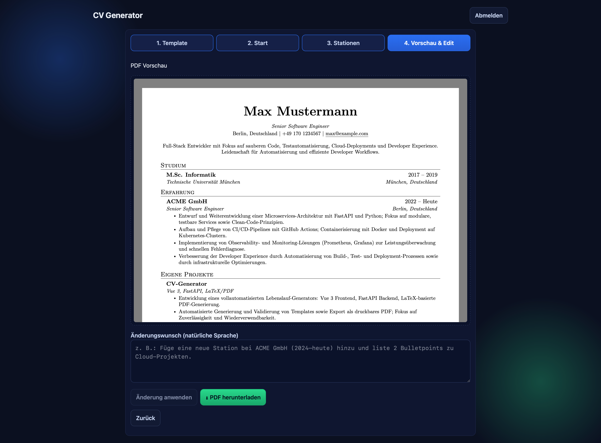

# CV Generator (Vue.js + FastAPI + Docker)

Ein kleines Fullstack-Projekt, das aus frei eingegebenem Text per OpenAI/ChatGPT kompilierbaren LaTeX-Code für einen Lebenslauf erzeugt und daraus ein PDF baut. Das LaTeX-Template ist konfigurierbar und wird serverseitig gespeichert.

## Architektur
- Frontend: Vue 3 (Vite) + Nginx (serviert Build und proxyt `/api` zum Backend)
- Backend: FastAPI (Python) mit Endpunkten zum Generieren (OpenAI) und Rendern (Tectonic)
- PDF-Build: [Tectonic](https://tectonic-typesetting.github.io/) LaTeX-Engine im Backend-Container
- Orchestrierung: Docker Compose

## Voraussetzungen
- Docker und Docker Compose
- OpenAI API Key
- Wenn du das Backend lokal ohne Docker startest: Installiere eine LaTeX-Engine
  (empfohlen: Tectonic). Beispiele:
  - macOS: `brew install tectonic`
  - Debian/Ubuntu: `sudo apt-get update && sudo apt-get install tectonic`
  - Alternativ (Fallback): `pdflatex`/`xelatex` aus einer TeX-Distribution

## Start
1. `.env` im Projektverzeichnis anlegen (siehe `.env.example` unten) oder Umgebungsvariablen setzen.
2. Build & Start:
   - `docker compose up --build`
3. Frontend öffnen: `http://localhost:8080`

## Screenshots
- Ablageort: Lege Screenshots im Repo unter `docs/screenshots/` ab (PNG/JPG/SVG). Der Ordner ist versioniert, damit Bilder in der README angezeigt werden können.
- Einbindung in Markdown (relative Pfade, funktionieren auf GitHub/GitLab):

  ```markdown
  
  
  
  ```

- Optionale Größenangabe mit HTML, wenn notwendig:

  ```html
  
  ```

- Tipps: Aussagekräftige Dateinamen (`startseite.png`, `login.png`), konsistente Benennung für helle/dunkle Themes (`editor-dark.png`, `editor-light.png`).

## Authentifizierung (Auth0)
- Landing Page (`/`) ist öffentlich, das Tool (`/tool`) ist per Auth0 geschützt.
- Alle Backend-API-Routen unter `/api/*` sind zusätzlich per JWT (Auth0 Access Token) geschützt; `GET /api/health` bleibt öffentlich.
- Erstelle eine SPA-App in Auth0 und trage Folgendes ein:
  - Allowed Callback URLs: `http://localhost:8080/callback`
  - Allowed Logout URLs: `http://localhost:8080`
  - Allowed Web Origins: `http://localhost:8080`
- Setze die folgenden Variablen in `.env` (werden beim Frontend-Build injiziert):
  - `VITE_AUTH0_DOMAIN` – z. B. `your-tenant.eu.auth0.com`
  - `VITE_AUTH0_CLIENT_ID` – Client ID der SPA-App
  - Optional: `VITE_AUTH0_AUDIENCE` – falls ein API-Audience genutzt wird

Backend erwartet zusätzlich (über Compose bereits verdrahtet):
- `AUTH0_DOMAIN` und `AUTH0_AUDIENCE` (werden aus den VITE-Variablen gespeist)

Das Frontend sendet das Access Token automatisch als `Authorization: Bearer ...` Header.

Hinweis: Die Werte werden zur Build-Zeit in das Frontend injiziert (Vite). Docker Compose übergibt sie als Build-Args an das Frontend.

## Umgebungsvariablen
- `OPENAI_API_KEY` (Pflicht): Dein OpenAI API Key
- `OPENAI_MODEL` (optional): z. B. `gpt-4o-mini` (Default), `gpt-4o`, `gpt-3.5-turbo`

Beispiel `.env`:
```
OPENAI_API_KEY=sk-...dein-key...
OPENAI_MODEL=gpt-4o-mini

# Auth0
VITE_AUTH0_DOMAIN=your-tenant.eu.auth0.com
VITE_AUTH0_CLIENT_ID=yourClientId
VITE_AUTH0_AUDIENCE=
```

## API Endpunkte (Backend)
- `GET /api/health` – Healthcheck
- `GET /api/template` – aktuelles LaTeX-Template lesen
- `PUT /api/template` – Template speichern; Body: `{ "template": "..." }`
- `POST /api/generate` – LaTeX generieren; Body: `{ "input_text": "...", "template_override"?: "..." }`; Antwort: `{ latex: "..." }`
- `POST /api/render` – PDF aus LaTeX erzeugen; Body: `{ "latex": "..." }`; Antwort: `application/pdf`
- `POST /api/generate-pdf` – Generieren und Rendern in einem Schritt; Body: `{ "input_text": "..." }`; Antwort: `application/pdf`

## Hinweise zur LaTeX-Kompilierung
- Der Backend-Container installiert Tectonic automatisch. Läuft das Backend lokal, nutzt der Code zuerst `tectonic`, fällt bei Nichtverfügbarkeit auf `pdflatex` bzw. `xelatex` zurück.
- Bei Nutzung externer LaTeX-Pakete lädt Tectonic diese ggf. zur Laufzeit nach (Internetverbindung erforderlich). Für reproduzierbare Builds empfiehlt sich ein Template, das mit dem Tectonic-Standard gut funktioniert.
- Templates werden im Volume `cv_templates` unter `/app/templates/cv_template.tex` persistiert.

## Entwicklung
- Frontend-Code liegt in `frontend/`, Backend in `backend/`.
- Lokaler Test ohne Docker ist möglich (uvicorn, vite), standardmäßig ist jedoch alles über Compose verdrahtet.

## Templates
- Auswahl im Tool unter Schritt 1. Die Vorschau-Bilder liegen im Frontend unter `frontend/src/assets/templates/`.
- Konfiguration der verfügbaren Templates im Frontend in `frontend/src/templates.js` (id, Name, Preview-Bild).
- Das Backend lädt Templates anhand der `id` aus dem Verzeichnis `TEMPLATE_DIR` (Standard: `/app/templates`).
  - Dateinamensschema: `<id>.tex` (z. B. `cv_template.tex`, `modern.tex`, `minimal.tex`).
  - Packaged Defaults: Falls vorhanden, werden auch Dateien unter `backend/app/templates/` berücksichtigt.
- Wenn ein ausgewähltes Template im Backend nicht existiert, wird ein 404 zurückgegeben.

## Sicherheit
- Setze den API-Key ausschließlich als Umgebungsvariable. Er wird nicht ins Frontend geleakt. Die Generierung erfolgt serverseitig.

## Troubleshooting
- Generierung schlägt fehl: Prüfe `OPENAI_API_KEY` und `OPENAI_MODEL` in der `.env`.
- LaTeX-Kompilierung schlägt mit "No such file or directory: 'tectonic'" fehl: Installiere Tectonic (s. Voraussetzungen) oder stelle sicher, dass eine LaTeX-Engine (`pdflatex`/`xelatex`) im `PATH` ist.
- LaTeX-Fehler: Prüfe die generierte LaTeX-Ausgabe in der UI und ggf. passe das Template an.
- Paket-Downloads blockiert: Tectonic benötigt Internetzugriff im Container, um fehlende Pakete nachzuladen.
